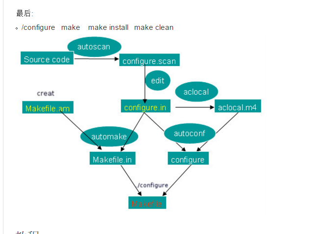
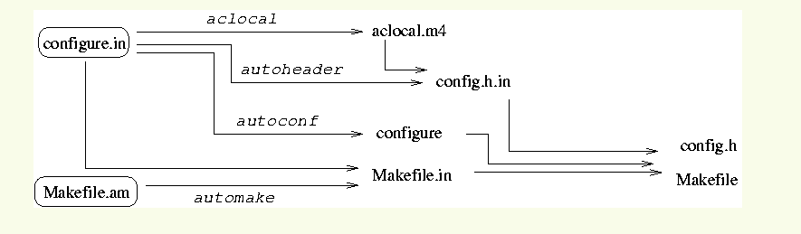
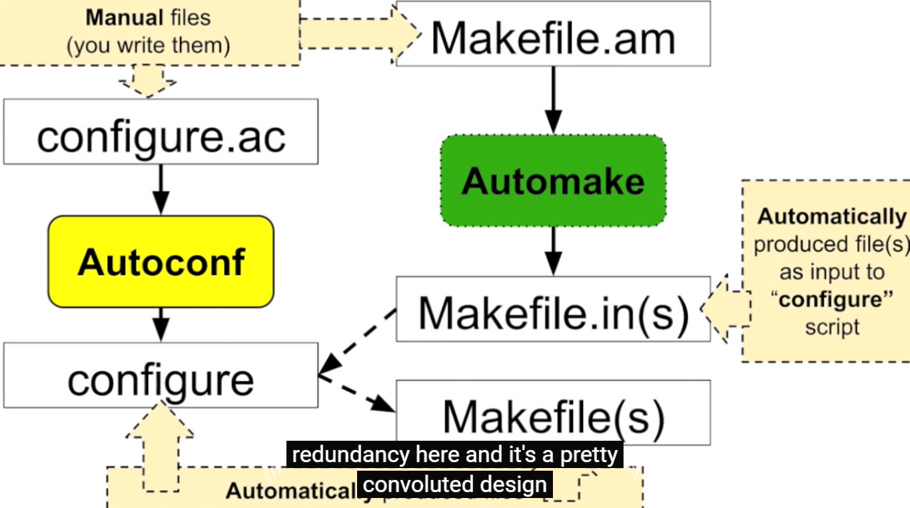
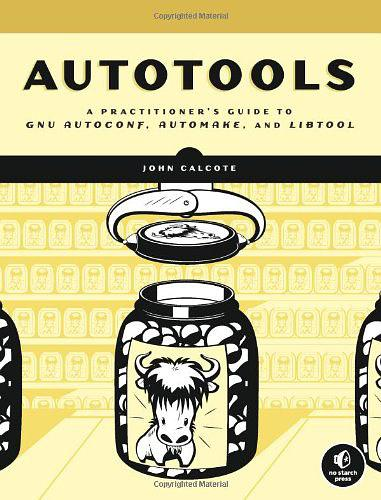

# learn-autotools

## 本仓库内容

* autotools工具集学习

自行翻译了一波《Autotools : a practitioner's guide to GNU Autoconf, Automake, and Libtool》，不喜求狂喷，谢谢！！

```
Something I hope you know before go into the coding~
First, please watch or star this repo, I'll be more happy if you follow me.
Bug report, questions and discussion are welcome, you can post an issue or pull a request.
```

## autotools简介

* 首先autotools是工具集！！工具集！！工具集！！
* 包括 aclocal + autoscan + autoconf + autoheader + automake
* 一般而言，对于小项目或玩具程序，手动编写 Makefile 即可。但对于大型项目，手动编写维护 Makefile 成为一件费时费力的无聊工作。所以诞生了该工具集

```
Autoconf： 用于为工程产生配置脚本；
Automake： 用于简化创建一致性和功能性Makefile的过程；
Libtools： 用于为共享库的可移植创建提供一个抽象；
```


## 相关站点

* 源码获取:<ftp://ftp.gnu.org/gnu/>
* GNU Autoconf站点:<http://www.gnu.org/software/autoconf>


## 目录

* [Preface](README.md)
* [GNU-Autotools简介](docs/A-Brief-Introduction-to-the-GNU-Autotools/A-Brief-Introduction-to-the-GNU-Autotools.md)
* [深入理解GNU编码风格](docs/Understanding-the-GNU-Coding-Standards/Understanding-the-GNU-Coding-Standards.md)
* [使用Autoconf配置你的项目](docs/Configuring-Your-Project-with-Autoconf/Configuring-Your-Project-with-Autoconf.md)
* [Autoconf更有趣的用法-配置个性选项](docs/More-Fun-with-Autoconf-Configuring-User-Options/More-Fun-with-Autoconf-Configuring-User-Options.md)
* [使用Automake自动生成Makefiles](docs/Automatic-Makefiles-with-Automake/Automatic-Makefiles-with-Automake.md)
* [使用Libtool构建库](docs/Building-Libraries-with-Libtool/Building-Libraries-with-Libtool.md)
* [库接口版本控制与运行时动态链接](docs/Library-Interface-Versioning-and-Runtime-Dynamic-Linking/Library-Interface-Versioning-and-Runtime-Dynamic-Linking.md)
* [举个Autools使用栗子-FLAIM项目](docs/FLAIM:An-Autotools-Example/FLAIM:An-Autotools-Example.md)
* [FLAIM项目后续高级玩法](docs/FLAIM-Part-II-Pushing-the-Envelope/FLAIM-Part-II-Pushing-the-Envelope.md)
* [在Autoconf中使用M4](docs/Using-the-M4-Macro-Processor-with-Autoconf/Using-the-M4-Macro-Processor-with-Autoconf.md)
* [创建大项目的技巧和可重用解决方案](docs/A-Catalog-of-Tips-and-Reusable-Solutions-for-Creating-Great-Projects/A-Catalog-of-Tips-and-Reusable-Solutions-for-Creating-Great-Projects.md)


## 思维导图








## 参考教程

《Autotools : a practitioner's guide to GNU Autoconf, Automake, and Libtool》




## 参考书籍


## 总结

```
* 理论联系实际，知道怎么操作，代码要会写，源码要看的懂。BUT 你懂GNU工程代码部署套路么？？
* 代码托管+项目部署+工具链 是完成一个大型项目不可或缺的基本工具，仅仅是基本工具。更牛逼，更高难度的还是代码设计思想。你怎么看？
```
